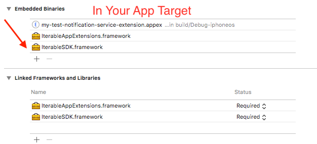
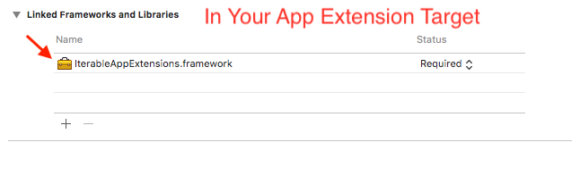
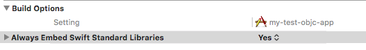

[](https://cocoapods.org/pods/Iterable-iOS-SDK)
[](https://opensource.org/licenses/MIT)
[](https://travis-ci.com/Iterable/swift-sdk)

# Iterable iOS SDK

`Iterable-iOS-SDK` is a Swift implementation of an iOS client for Iterable, for iOS versions 9.0 and higher.

# Before Starting

Before you even start with the SDK, you will need to setup Iterable push notifications for your app. 

For more information, see [Getting Started Guide](https://support.iterable.com/hc/en-us/sections/201117965-Mobile). 
 
# Automatic Installation (via CocoaPods)

Iterable supports [CocoaPods](https://cocoapods.org) for easy installation. If you don't have it yet, please refer to [this document](https://guides.cocoapods.org/using/getting-started.html) to install Cocoapods.

To include the Iterable SDK in your project, edit the `Podfile` and add the Iterable-iOS-SDK pod to your app target:

```
pod 'Iterable-iOS-SDK'
```

If you want to include Iterable Rich Notification Extension you will also need to include the Iterable-iOS-AppExtensions pod to your extension target:

```
pod 'Iterable-iOS-AppExtensions'
```


Please look at the included sample project pod file [HERE](./sample-apps/swift-sample-app/Podfile).

Congratulations! You have now imported the Iterable SDK into your project! 

# Manual Installation

Attached to the release you will find two framework bundles. 

	IterableSDK.framework 
	IterableAppExtensions.framework
	
1. In XCode choose the target for your app. Now add IterableSDK.framework to the **embedded binaries** section. If you want to use Iterable Rich Notification Extension you will have to add IterableAppExtensions.framework to the embedded binaries section as well.

    

2. If you want to use Iterable Rich Notifiation Extension, you will need to add IterableAppExtension.framework to **Linked Frameworks and Libraries** section of your **app extension** target (not app target). Please note that you will have to add the IterableAppExtension.framework bundle to **both** the app target (step 1) and app extension target (step 2) of your project.
    
3. In build settings, set `Always Embed Swift Standard Libraries` setting to 'Yes'.
	
 

# Using the SDK
1. ##### Initialize the API with API key.

   On application launch (`application:didFinishLaunchingWithOptions:`), initialize the Iterable SDK:

	```swift
	let config = IterableConfig()
	config.pushIntegrationName = "<your-iterable-push-integration-name>"
	IterableAPI.initialize(apiKey: "<your-api-key>", launchOptions: launchOptions, config:config)
	```
  * See the Iterable guide on how to setup your Iterable push integration [here](https://support.iterable.com/hc/en-us/articles/115000315806-Setting-Up-iOS-Push-Notifications).	
	
2. ##### Set userId or email. 

	Once you know the email or userId of the user, set the value.

	```swift
	IterableAPI.email = "user@example.com"
	```
	
3. ##### Send Remote Notification Token to Iterable

	* See [Apple Notification Guide](https://developer.apple.com/documentation/usernotifications) regarding how to register for remote notifiations.
	* In your `AppDelegate`’s [application:didRegisterForRemoteNotificationsWithDeviceToken:](https://developer.apple.com/documentation/uikit/uiapplicationdelegate/1622958-application) method, send the token obtained to Iterable.

	```swift
	func application(_ application: UIApplication, didRegisterForRemoteNotificationsWithDeviceToken deviceToken: Data) {
        IterableAPI.register(token: deviceToken)
    }
    ```
4. ##### Handle Push Notifications
	When the user taps on the push notification or one of the action buttons, the system calls `UNUserNotificationCenterDelegate`'s [userNotificationCenter:didReceiveNotificationResponse:withCompletionHandler:](https://developer.apple.com/documentation/usernotifications/unusernotificationcenterdelegate/1649501-usernotificationcenter?language=objc). Pass this call to `IterableAppIntegration` to track push open event and perform the associated action (see below for custom action and URL delegates).

# Receiving Remote Push Notifications

Application Running? | In foreground? | Notification Shown? | Delegate | When | Notes
--- | --- | --- | --- | --- | ---
Yes | Yes | No | `userNotificationCenter:willPresent:withCompletionHandler:` | Immediately | call `IterableAPI.track:pushOpen` and pass in `userInfo`
Yes | No | Yes | `userNotificationCenter:didReceiveNotificationResponse:withCompletionHandler:` | On Notification Click | call `IterableAppIntegration.userNotificationCenter:didReceive:withCompletionHandler:`
No | N/A | Yes | `application:didFinishLaunchingWithOptions:` | On Notification Click | initialize `IterableAPI` and pass in `launchOptions`; a push open will be tracked automatically

* For iOS 9, UserNotifications is not availa ble, use `application:didReceiveRemoteNotification:` instead.

For more information about local and remote notifications, and which callbacks will be called under which circumstances, see [Local and Remote Notifications in Depth](https://developer.apple.com/library/ios/documentation/NetworkingInternet/Conceptual/RemoteNotificationsPG/Chapters/WhatAreRemoteNotif.html#//apple_ref/doc/uid/TP40008194-CH102-SW1).

# Additional Information

See our [setup guide](http://support.iterable.com/hc/en-us/articles/204780589-Push-Notification-Setup-iOS-and-Android-) for more information.

Also see our [push notification setup FAQs](http://support.iterable.com/hc/en-us/articles/206791196-Push-Notification-Setup-FAQ-s).

# License

The MIT License

See [LICENSE](https://github.com/Iterable/iterable-ios-sdk/blob/master/LICENSE)

## Want to Contribute?

This library is open source, and we will look at pull requests!

See [CONTRIBUTING](CONTRIBUTING.md) for more information.
