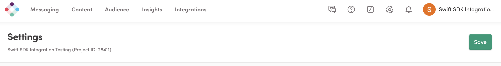
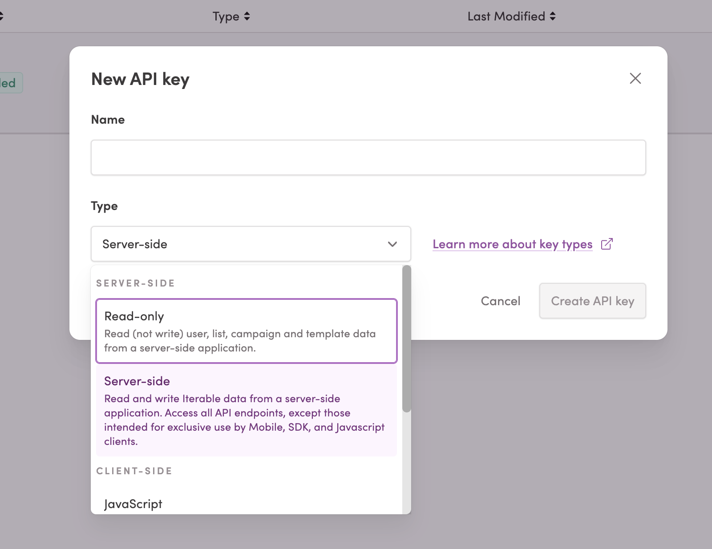
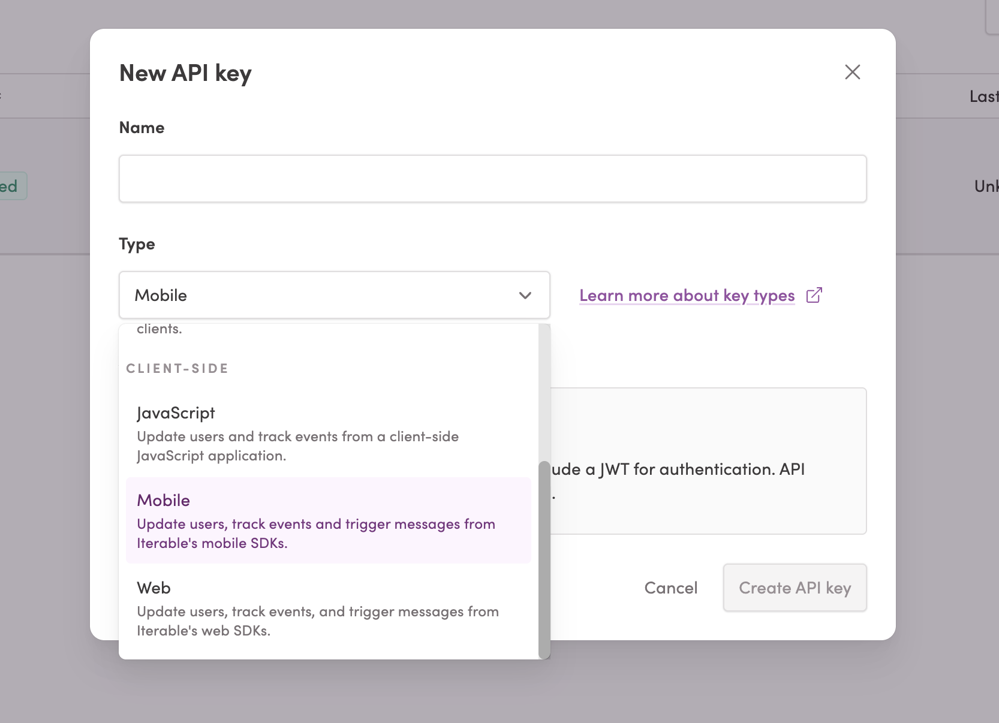
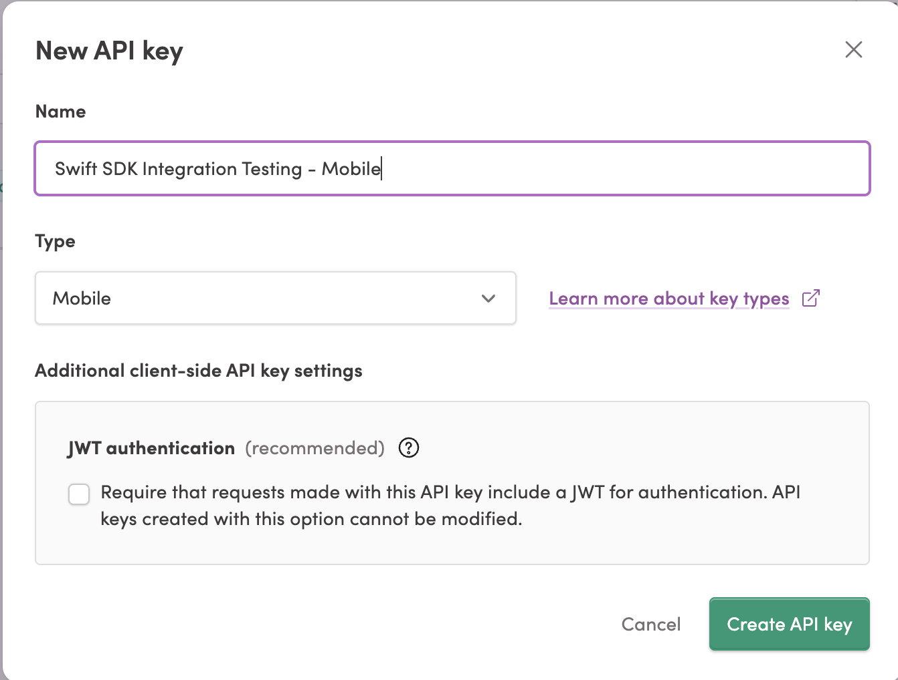

# Iterable Swift SDK - Local Integration Testing Framework

A complete testing framework that validates your Iterable Swift SDK integration locally on your Mac before deploying to production.

## 🎯 What This Does

This testing framework helps you verify that your iOS app correctly integrates with Iterable's marketing platform by testing:

- **Push Notifications** - Messages sent to your app users' devices
- **In-App Messages** - Pop-up messages shown within your app
- **Embedded Messages** - Content embedded in your app's interface
- **Deep Links** - Links that open specific screens in your app

## 📋 Prerequisites

Before you start, make sure you have:

- A Mac computer (macOS 13.0 or later)
- Xcode installed from the App Store
- An active Iterable account
- Basic familiarity with Terminal/Command Line

## 🔑 Step 1: Get Your Iterable Project ID

### 1.1 Log into Iterable

1. Go to [Iterable.com](https://iterable.com) and log into your account


### 1.2 Get Your Project ID 



1. In Settings, click on [Project Settings](https://app.iterable.com/settings/project) 
2. Your Project ID is shown at the top
3. Copy this ID for later use

## 🛠 Step 2: Set Up the Testing Environment

### 2.1 Understanding API Key Types

**IMPORTANT:** You need **BOTH** types of API keys for complete integration testing:

#### 🔑 Server-side Key (for Backend Operations)


**Use for:** Creating test users, managing data, sending campaigns
- Allows "Read and write Iterable data from a server-side application"
- **Required:** This setup script uses it to create your test user automatically

#### 📱 Mobile Key (for SDK Testing)


**Use for:** Actual Swift SDK integration testing
- Allows "Update users, track events and trigger messages from Iterable's mobile SDKs"
- **Required:** Your iOS app uses this for all SDK operations

### 2.2 Get Your API Keys

1. In the Iterable dashboard, click on **Integrations** tab
2. Select **API Keys** from the drop down menu (You can click [here](https://app.iterable.com/settings/apiKeys) to go there directly)
3. Click **"Create New API Key"** 
4. **Create TWO keys:**
   - One with **"Server-side"** type (for user management)
   - One with **"Mobile"** type (for SDK testing)
   - **Important** - While creating the mobile key do not select **JWT Authentication** checkbox.

   


5. Name them clearly like "Integration Tests - Server" and "Integration Tests - Mobile"


> **📝 Note:** Both API keys look like this: `sk_1a2b3c4d5e6f7g8h9i0j`


### 2.1 Open Terminal

1. Press `Cmd + Space` to open Spotlight
2. Type "Terminal" and press Enter
3. A black window will open - this is your Terminal

### 2.2 Navigate to the Test Directory

Copy and paste this command into Terminal and press Enter:

```bash
cd /Users/$(whoami)/Projects/swift-sdk/tests/business-critical-integration
```

### 2.3 Run the Setup Script

Copy and paste this command and press Enter:

```bash
./scripts/setup-local-environment.sh
```

The script will guide you through:
- ✅ Checking if your Mac is ready for testing
- ✅ Setting up an iOS Simulator
- ✅ Configuring your API keys
- ✅ Creating test configuration files

### 2.4 Enter Your Information

The script will ask for three things **IN THIS ORDER**:

1. **📋 Project ID**: Enter your Iterable Project ID from Step 1.4
2. **🔑 Server-side API Key**: Paste your server-side key for user management  
3. **📱 Mobile API Key**: Paste your mobile key for SDK testing

The script will then automatically:
- ✅ Create a daily test user (e.g., `2025-01-07-integration-test-user@test.com`) in your project
- ✅ Set up your local testing environment
- ✅ Configure everything needed for testing

## 🚀 Step 3: Run Your First Test

### 3.1 Test Push Notifications

Run this command to test push notification functionality:

```bash
./scripts/run-tests.sh push
```

You should see output like:
```
🧪 Iterable Swift SDK - Local Integration Tests
✅ Configuration validated
✅ iOS Simulator ready
📱 Running push notification tests...
```

### 3.2 Test All Features

To test everything at once:

```bash
./scripts/run-tests.sh all
```

### 3.3 Run with Detailed Output

For more detailed information during testing:

```bash
./scripts/run-tests.sh all --verbose
```

## 📱 Step 4: Test with the Sample App

### 4.1 Open the Sample App

1. In Finder, navigate to: `swift-sdk/sample-apps/swift-sample-app/`
2. Double-click `swift-sample-app.xcodeproj` to open it in Xcode

### 4.2 Configure for Testing

1. In Xcode, find the file `AppDelegate.swift`
2. Look for the line: `let iterableApiKey = ""`
3. Replace the empty quotes with your API key: `let iterableApiKey = "your_api_key_here"`

### 4.3 Run in Test Mode

1. In Xcode, click the **Run** button (▶️)
2. The app will open in the iOS Simulator
3. Look for a yellow banner that says "🧪 INTEGRATION TEST MODE 🧪"
4. You'll see test buttons at the bottom of the screen

### 4.4 Try the Test Buttons

- **Test Push Registration**: Checks if push notifications work
- **Test In-App Message**: Shows how in-app messages appear
- **Test Deep Link**: Validates link handling
- **View Test Results**: Shows a summary of test results

## 📊 Step 5: Understanding Test Results

### 5.1 What Success Looks Like

✅ **Green checkmarks** mean tests passed
❌ **Red X marks** mean tests failed
⚠️ **Yellow warnings** mean tests passed but with issues

### 5.2 Reading Test Reports

After running tests, check these folders:
- `reports/` - Detailed test results in JSON and HTML format
- `logs/` - Technical logs for troubleshooting
- `screenshots/` - Screenshots of test execution

### 5.3 Common Success Indicators

- "Device token registered" - Push notifications are working
- "In-app message displayed" - Message system is functioning
- "Deep link processed" - Link handling is correct

## ❓ Troubleshooting

### Problem: "API key not configured"
**Solution:** Re-run the setup script and make sure you entered your API key correctly

### Problem: "Simulator not found"
**Solution:** 
1. Open Xcode
2. Go to **Window > Devices and Simulators**
3. Make sure you have at least one iOS simulator installed

### Problem: "Permission denied"
**Solution:** Run this command to fix permissions:
```bash
chmod +x ./scripts/setup-local-environment.sh
chmod +x ./scripts/run-tests.sh
```

### Problem: Tests show warnings but no failures
**Solution:** This is normal! Some tests may show warnings in a local environment that wouldn't occur with real users.

## 🔧 Advanced Usage

### Custom Test Configuration

You can modify test settings by editing:
```bash
config/test-config.json
```

Common settings to adjust:
- `timeout`: How long to wait for tests (in seconds)
- `enableDebugLogging`: Show more detailed output
- `testUserEmail`: Change the test email address

### Running Specific Test Types

```bash
# Test only push notifications
./scripts/run-tests.sh push

# Test only in-app messages  
./scripts/run-tests.sh inapp

# Test only embedded messages
./scripts/run-tests.sh embedded

# Test only deep linking
./scripts/run-tests.sh deeplink
```

### Viewing Detailed Logs

To see everything that's happening:
```bash
./scripts/run-tests.sh all --verbose --no-cleanup
```

## 📞 Getting Help

### Check Your Setup
```bash
./scripts/setup-local-environment.sh --check
```

### View Help Information
```bash
./scripts/run-tests.sh --help
```

### Common Commands Reference

| Command | What It Does |
|---------|-------------|
| `./scripts/setup-local-environment.sh` | Initial setup |
| `./scripts/run-tests.sh all` | Run all tests |
| `./scripts/run-tests.sh push --verbose` | Test push with details |
| `open reports/` | View test reports in Finder |

## 🎉 What's Next?

Once your local tests are passing:

1. **Review Results**: Check the HTML reports in the `reports/` folder
2. **Validate in Iterable**: Log into your Iterable dashboard to see test data
3. **Deploy with Confidence**: Your integration is ready for production
4. **Set Up CI/CD**: Use these tests in your automated deployment pipeline

## 📚 Additional Resources

- [Iterable iOS SDK Documentation](https://support.iterable.com/hc/en-us/articles/115000315806-Mobile-SDK-iOS-)
- [Iterable API Documentation](https://api.iterable.com/api/docs)
- [iOS Push Notification Guide](https://support.iterable.com/hc/en-us/articles/115000315806)

---

**Need More Help?** 
- Contact your Iterable Customer Success Manager
- Check the Iterable Support Center
- Review the technical documentation in this repository

**Happy Testing!** 🧪✨